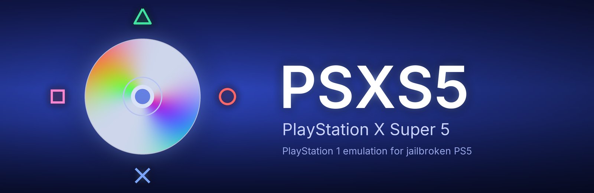
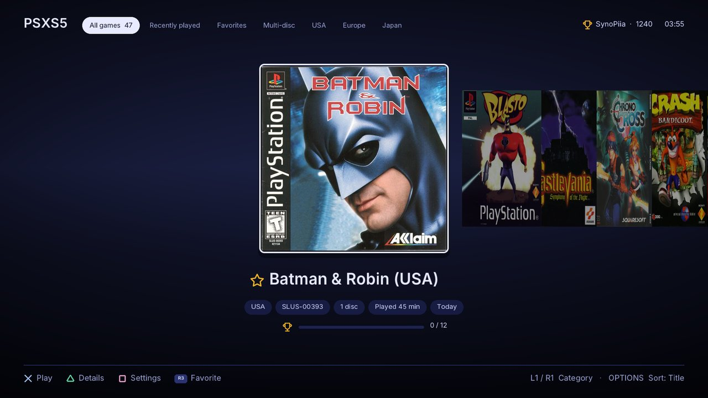
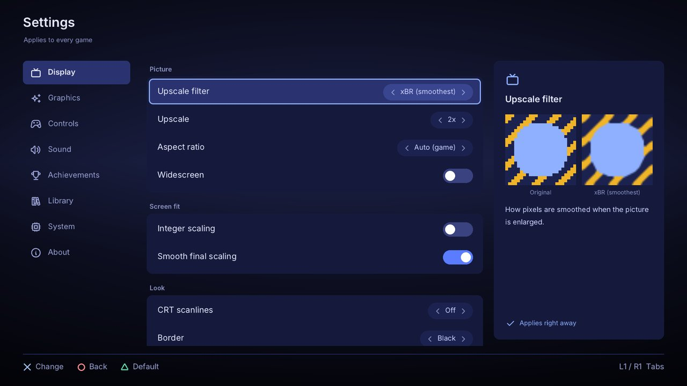
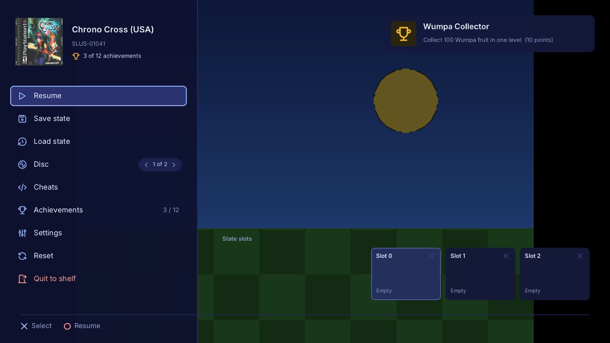
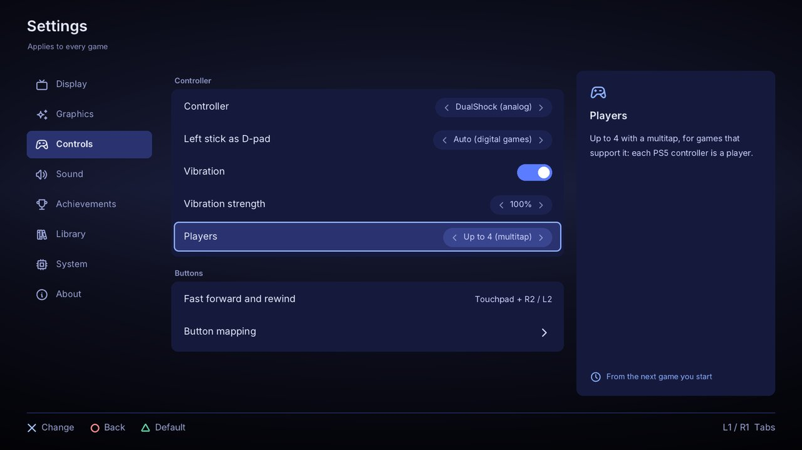
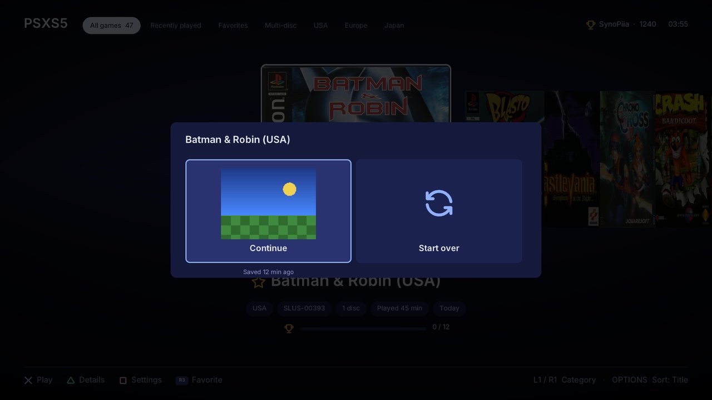
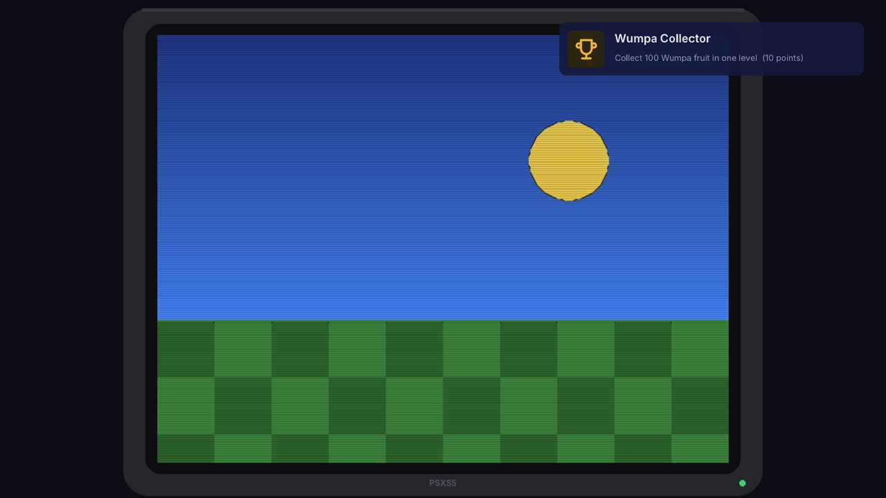

<p align="center">
  
</p>

<h3 align="center">PlayStation 1 emulation, running natively on a jailbroken PS5.</h3>

<p align="center">
  
  
  
  
</p>

---

## What is PSXS5?

PSXS5 (PlayStation X Super 5) is a PlayStation 1 emulator that installs as an app on the PS5 home screen.

- The emulation is [PCSX-ReARMed](https://github.com/libretro/pcsx_rearmed), built into the app and running on the PS5's own CPU.
- You pick a game from a cover-flow shelf with your covers.
- Games are upscaled with xBR for a 4K TV.

## Screenshots

<p align="center">
  
  
</p>
<p align="center">
  
  
</p>
<p align="center">
  
  
</p>

The in-game shots show a test picture; your games appear there.

## A passion project

PSXS5 is a hobby project, made for the love of the PS1 library. No company or schedule is behind it, and nothing is for sale. Expect rough edges. Bug reports that come with `/data/PSXS5/logs/psxs5.log` are the most helpful.

## Highlights

- **Quick resume.** Leave a game and pick it up later: the shelf offers *Continue* (with a picture of where you were) or *Start over*.
- **Rewind and fast forward.** Hold the touchpad and press L2 to go back a few seconds, or R2 to speed through cutscenes.
- **Save states with pictures.** Ten slots per game, each showing a thumbnail and how long ago it was saved.
- **One-switch widescreen.** Turns on a game's widescreen code from the cheat library and shows 16:9.
- **CRT look.** Light or strong scanlines, and a soft glow or a 90s TV around the picture.
- **Up to 4 players.** A multitap for the games that support it: each PS5 controller is a player.
- **Fan translations.** Put a `.ppf` patch next to a game and PSXS5 applies it when the game starts.
- **Memory card manager.** See the saves on every game's card, export cards for other emulators, import `.mcr`, `.mcd`, `.srm` or `.gme` cards.
- **Achievements list.** Every achievement of the game you're playing, with badges and progress, from the in-game menu.
- **Settings from your phone.** Turn it on and scan the QR code: a settings page opens on any phone on the same network.
- **Updates from GitHub.** PSXS5 tells you when a new release is out and installs it from *Settings → About*.
- **Native app.** A real home-screen title (`PPSA97510`) with its own icon and art. Nothing is streamed and no PC is needed while you play.
- **A shelf for your games.** A 3D cover flow with reflections and a soft click as you browse.
  - Covers are matched by the serial read from each disc, so every region gets its own art.
  - Missing covers download on the console.
  - Your own art wins: a `cover.png`/`.jpg` in the game's folder, or an image in `/data/PSXS5/covers/` named like the game's title, its disc file or its serial (`Crash Bandicoot.png`, `SCUS-94900.jpg`).
  - Or pick one by hand: on the shelf press **Triangle** (Details), then **Square**, and choose any image from `covers/` or the game's folder.
- **Plays every common format.** `.cue`/`.bin`, `.chd`, `.pbp` (including multi-disc), `.iso`, `.img`, `.mdf`, `.ccd` and `.m3u` playlists for multi-disc games.
- **Sharp on a 4K TV.**
  - Internal resolution: native or 2x (sharper 3D).
  - Upscale: 1x to 4x, with three filters:
    - Sharp pixels
    - Smooth pixels (Scale2x/3x)
    - xBR, the smoothest edges for 2D art
  - Aspect ratio: auto, 4:3, 16:9, 16:10, 1:1 pixels or stretch.
  - Integer scaling, bilinear smoothing and dithering on or off.
- **Built for full speed.** Aims at 60 fps (50 for PAL games). Scaling is spread over the PS5's CPU cores, and the video goes straight to the PS5's display output.
- **RetroAchievements.** Earn [RetroAchievements](https://retroachievements.org) as you play.
  - Unlocks and leaderboard results pop up on screen.
  - Optional hardcore mode.
  - See [RetroAchievements](#retroachievements).
- **Cheats for every game.** PSXS5 reads RetroArch `.cht` files (GameShark / Action Replay codes).
  - The PC tool installs about 2,000 of them from libretro-database and matches them to your games.
  - Toggle them per game from the in-game menu.
- **Save states.** 10 slots per game, plus memory cards saved per game.
- **DualSense ready.**
  - DualShock analog with rumble.
  - On digital-only games, the left stick drives the D-pad.
  - Cross confirms and Circle goes back in the menus.
- **Real BIOS or none.** Games boot with PCSX-ReARMed's built-in HLE BIOS. If you put your own BIOS dump in `bios/`, PSXS5 uses it.
- **Five languages.** English, Français, Português (Portugal), Español (Latinoamérica) and 日本語, under Settings → Library → Language.
- **Quiet interface sounds.** Five styles (Soft, Wood, Pop, Chime, Classic), a volume setting, or off.
- **A PC tool for your library.** `tools/psxs5_sync.py` prepares your games on Windows and uploads them over FTP:
  - unpacks archives
  - writes missing `.cue` sheets and `.m3u` playlists
  - fetches covers and cheats
- **Logs that help.** A session log and a crash report (with addresses for the symbol map) stay on the console.

## What you need

- **A jailbroken PS5** with [etaHEN](https://github.com/etaHEN/etaHEN) and kstuff loaded. Development happens on firmware 13.60.
- **[ShadowMountPlus](https://github.com/drakmor/ShadowMountPlus)**, loaded at every boot. It puts PSXS5 on the home screen from `/data/homebrew/PPSA97510/`.
- **An FTP client**, such as etaHEN's FTP server on port 2121 with FileZilla, or the included PC tool.
- **Your own games**, dumped from discs you own.
- **Optional: your own PS1 BIOS**, dumped from your own console. Without one, the built-in HLE BIOS is used and most games run fine.

> **No BIOS files, games, keys or cheats with copyrighted content are included with PSXS5, and none will be provided.** You have to supply your own legally made backups.

## Getting started

1. **Download** the `PSXS5-v*.zip` from the [latest release](../../releases/latest) and extract it. Inside is a `PPSA97510` folder and the PC tools.
2. **Install the app.** Copy the `PPSA97510` folder to `/data/homebrew/` on the PS5 over FTP. Then set its permissions to `777`: in FileZilla, right-click the folder → *File permissions* → `777`, recurse into subdirectories. Without this, the PS5 says *"Can't start the game or app"* (CE-107750-0). The PC tool does all of this for you:
   ```bash
   python tools/psxs5_sync.py app --app-dir PPSA97510 --host <PS5 IP>
   ```
3. **Restart ShadowMountPlus** (or the console). PSXS5 appears on the home screen.
4. **Start PSXS5 once.** It creates its folders in `/data/PSXS5/` (see [below](#folders-on-the-console)) and shows an empty shelf that tells you where games go.
5. **Add your games** to `/data/PSXS5/games/`, **one folder per game**, with every file of the game inside it:
   ```text
   /data/PSXS5/games/Final Fantasy VII/   FF7 Disc 1.cue, FF7 Disc 1.bin, ... (any format above)
   /data/PSXS5/games/Crash Bandicoot/     Crash Bandicoot.chd
   ```
   Or let the PC tool prepare and upload a whole folder of games (see [PC tool](#pc-tool)).

   > **Shelf still empty?** When etaHEN doesn't unlock `/data`, PSXS5 can't look into the games folder and only shows the games listed in `/data/PSXS5/library.txt`, which the PC tool writes when it uploads. For games you copied another way (FileZilla, a file manager, a USB drive), let the tool list them:
   > ```bash
   > python tools/psxs5_sync.py index --host <PS5 IP> --fix-cues
   > ```
   > `--fix-cues` repairs `.cue` files that point at a `.bin` that was renamed, for example to `BREATH~1.BIN` by a FAT32 copy.
6. **Optional: add your BIOS.** Put your own dump directly in `/data/PSXS5/bios/`, not in a subfolder, and keep its standard name: `scph5501.bin` (US), `scph5500.bin` (Japan) or `scph5502.bin` (Europe) are the best choices; `scph1001.bin` and `scph101.bin` also work. *Settings → System* shows whether it was found. From a PC: `python tools/psxs5_sync.py bios scph5501.bin --host <PS5 IP>`.
7. **Restart PSXS5.** Covers download the first time, then the shelf opens with your games.

> **Where do things go?** Games: `/data/PSXS5/games/<Game name>/`. BIOS: `/data/PSXS5/bios/`. PSXS5 creates both folders the first time it starts; you can also create them yourself over FTP.

### Unlocking /data (so PSXS5 can see your games)

A PS5 app can read and write files in `/data`, but it can't list folders unless something running on the console unlocks it. PSXS5 asks every time it starts. Any one of these answers:

| On your console | What to do |
|---|---|
| **[LegacyJB](https://github.com/Phoenixx1202/LegacyJB)** | Load it with your payloads at each boot. It unlocks any app. |
| **etaHEN** | Turn on *Legacy CMD server* in the etaHEN toolbox. PSXS5 asks on port 9028. |
| **PS5SX2 Helper** (the PS2 emulator's helper) | It only unlocks apps listed in `/data/whitelist.txt`. Use *Settings → System → Allow PSXS5 in PS5SX2 Helper*, then reload the helper or restart the console. |

The log shows the result: `storage: unlocked`, or `storage: sandboxed (...)` with the reason. Sandboxed still works, but PSXS5 then only knows the games in `/data/PSXS5/library.txt` (written by the PC tool's `upload` and `index` commands).

### Folders on the console

```text
/data/homebrew/PPSA97510/     the app
/data/PSXS5/
├── games/<Game name>/        your games, one folder per game (a cheats.cht here overrides the library)
├── bios/                     optional: your BIOS dump (scph*.bin)
├── covers/                   your own cover images (named like the game, or picked on the shelf);
│                             downloads in default/ and 3d/, picks in custom/
├── cheats/                   the .cht library
├── saves/                    memory cards, one per game
├── states/                   save states, 10 slots per game
├── logs/psxs5.log            the session log (send this with bug reports)
├── retroachievements.ini     RetroAchievements sign-in (token only)
└── psxs5.ini                 settings
```

## Controls

**On the shelf**

| Button | Does |
|---|---|
| D-pad or left stick | Browse the games |
| L1 / R1 | Jump a page |
| Cross | Play |
| Triangle | Game details |
| Square | Settings |
| Circle | Back |

**In a game**

| Button | Does |
|---|---|
| OPTIONS | PS1 START |
| Touchpad tap | PS1 SELECT |
| Hold the touchpad (0.5 s) or L3 + R3 | The PSXS5 menu |
| Hold the touchpad + R2 | Fast forward |
| Hold the touchpad + L2 | Rewind (turn on *Settings → System → Rewind*) |
| Left stick | Analog stick; on digital-only games it also drives the D-pad (*Left stick as D-pad* in Settings) |

The **PSXS5 menu** has:
- resume
- save and load state (slots 0–9)
- disc change, for multi-disc games
- cheats
- reset
- settings
- quit to the shelf

## Settings

| Section | Settings |
|---|---|
| Video | Internal resolution (native, 2x), upscale (off, 2x, 3x, 4x), upscale filter (sharp, Scale2x, xBR), aspect ratio, integer scaling, smooth final scaling, dithering, FPS counter |
| System | Region (auto, NTSC, PAL), BIOS (real if present, or built-in HLE), controller (digital or DualShock), left stick as D-pad, fast CD loading, unlocking `/data` with etaHEN |
| RetroAchievements | Account, hardcore mode |
| Library | Cover style (flat or 3D box), download missing covers, language, interface sound and volume, rescan library |

Video settings apply while you play. Region, BIOS and controller apply from the next game.

## RetroAchievements

PSXS5 never asks for your password on the console. You sign in once from your PC: the tool swaps your password for a login token, and only the token is copied to the PS5.

```bash
python tools/psxs5_sync.py ra-login --host <PS5 IP>
```

Restart PSXS5 and it signs in by itself. Start a game, and if it has an achievement set, a banner shows how many you have unlocked.

- **Hardcore mode** (Settings → RetroAchievements) turns off loading states and cheats, as RetroAchievements requires. Turning it on restarts the running game.
- Without a connection, unlocks are kept and sent when the console is back online.
- Games are recognised by the same disc hash RetroArch uses, so the usual RetroAchievements-compatible dumps (Redump) work.

## Cheats

The PC tool downloads libretro-database's PlayStation cheats and installs the right file for each of your games:

```bash
python tools/psxs5_sync.py cheats --host <PS5 IP>
```

In a game, open the PSXS5 menu → **Cheats** and switch codes on and off. Your choice is remembered per game. To use your own codes, put a `cheats.cht` in the game's folder.

## PC tool

`tools/psxs5_sync.py` runs on Windows with Python 3 (and [7-Zip](https://www.7-zip.org/) for archives).

```bash
python tools/psxs5_sync.py plan    --source E:\ISO\PSX                 # what it would do, read-only
python tools/psxs5_sync.py sync    --source E:\ISO\PSX --host <PS5 IP>  # prepare + upload, one game at a time
python tools/psxs5_sync.py covers  --host <PS5 IP>                     # covers for your games
python tools/psxs5_sync.py cheats  --host <PS5 IP>                     # the cheat library
python tools/psxs5_sync.py bios    scph5501.bin --host <PS5 IP>        # your own BIOS dump
python tools/psxs5_sync.py ra-login --host <PS5 IP>                    # RetroAchievements
python tools/psxs5_sync.py app     --app-dir PPSA97510 --host <PS5 IP> # install or update the app
```

`sync` handles the whole library, one game at a time:
- unpacks `.7z` / `.rar` / `.zip` archives, including archives inside archives and split archives
- writes missing `.cue` sheets and `.m3u` playlists for multi-disc games
- skips duplicates
- uploads to `/data/PSXS5/games/`
- sets the permissions

It remembers what is already on the console, so you can run it again whenever you add games.

## Known limitations

- **Rendering is on the CPU.** It is fast enough for full speed, but internal resolution stops at 2x and HD texture packs aren't supported.
- **Sandboxed mode.** If etaHEN won't unlock `/data`, PSXS5 still runs: it reads the game list the PC tool uploads (`library.txt`) instead of listing the folder.
- **Closing from the PS button** crashed the console once during testing while `/data` was unlocked through etaHEN. If it happens to you, set *Settings → System → Unlock /data with etaHEN* to Off and let us know.
- The PS5's own keyboard and on-screen keyboard aren't used, so text entry (like the RetroAchievements sign-in) happens on the PC.

## Building from source

The PS5 app is built by GitHub Actions on every push (*Actions* → latest run → `PSXS5-PPSA97510` artifact). To build it yourself on Linux or WSL (Ubuntu 24.04):

```bash
sudo apt install clang-18 lld-18 llvm-18 make ninja-build ccache pkg-config python3 python3-venv tar unzip wget
git clone --recursive https://github.com/SynoPiia/PSXS5.git
cd PSXS5
make            # -> dist/PPSA97510/
make desktop    # optional PC test build (needs libsdl2-dev libcurl4-openssl-dev zlib1g-dev)
```

`make` builds PCSX-ReARMed (`tools/build-core.sh`) and rcheevos (`tools/build-rcheevos.sh`) as static libraries, compiles `src/` and signs `eboot.bin`.

| Path | What |
|---|---|
| `src/main.c` | screens and main loop |
| `src/core/host.c` | libretro host for the built-in core |
| `src/ra/` | RetroAchievements |
| `src/ui/` | cover flow, text, sounds |
| `src/platform/` | PS5 video output, input, heap, scaling filters |
| `tools/psxs5_sync.py` | the PC tool |
| `tools/make_art.py` | generates the icon, home-screen art and this page's banner |
| `docs/boilerplate/` | documentation of the PS5 app boilerplate PSXS5 is built on |

## Credits

PSXS5 is built on the work of a lot of people. Thank you all.

* **notaz, the PCSX / PCSX-Reloaded teams and the libretro contributors**, for [PCSX-ReARMed](https://github.com/libretro/pcsx_rearmed), which does all the emulating, and for [libretro](https://www.libretro.com/), the interface PSXS5 drives it through.
* **BlackBearReloaded**, for [ps5-native-app-boilerplate](https://github.com/blackbearreloaded/ps5-native-app-boilerplate), the build pipeline, runtime and deploy tooling that turn PSXS5 into a home-screen app.
* **John Törnblom**, for the [ps5-payload-dev](https://github.com/ps5-payload-dev) SDK, and PacBrew's SDL2 and libcurl ports.
* **SvenGDK**, for [SharpProspero](https://github.com/SvenGDK/SharpProspero), whose ELF converter and FSELF writer sign `eboot.bin`.
* **The etaHEN team**, for [etaHEN](https://github.com/etaHEN/etaHEN): the HEN, its FTP server and ELF loader, and the on-demand jailbreak PSXS5 asks for to reach `/data`. Thanks also to the kstuff authors and maintainers.
* **drakmor**, for [ShadowMountPlus](https://github.com/drakmor/ShadowMountPlus), which puts PSXS5 on the home screen, and **VoidWhisper**, for ShadowMount, which it's based on.
* **ArkSama / Team PHU and mpereiraesaa**, for [PS5-Lapy-JB-Daemon](https://github.com/ArkSama/PS5-Lapy-JB-Daemon), the fallback sandbox elevation.
* **[RetroAchievements](https://retroachievements.org)**, for the achievements, the community that makes the sets, and its [rcheevos](https://github.com/RetroAchievements/rcheevos) library.
* **[xlenore/psx-covers](https://github.com/xlenore/psx-covers)**, for the covers the shelf downloads.
* **The [libretro-database](https://github.com/libretro/libretro-database) contributors**, for the PlayStation cheat library.
* **Swordpdf**, for [PS5SX2](https://github.com/Swordpdf/PS5SX2). Its shelf and project page inspired PSXS5's, and studying it and the other PS5 emulator ports showed how a native emulator title runs on the console.
* **Hyllian**, for the xBR upscaler, and **Andrea Mazzoleni** (AdvanceMAME), for Scale2x / Scale3x.
* **Sam Lantinga and the SDL contributors** for [SDL2](https://www.libsdl.org/), **Daniel Stenberg** for [curl](https://curl.se/), **Sean Barrett** for [stb](https://github.com/nothings/stb), **Rasmus Andersson** for the [Inter](https://github.com/rsms/inter) font, **Google and Adobe** for [Noto Sans JP](https://github.com/notofonts/noto-cjk) (the Japanese text), and **Doug Lea** for [dlmalloc](https://gee.cs.oswego.edu/dl/html/malloc.html).
* **Microsoft's [DirectXTex](https://github.com/microsoft/DirectXTex)**, **[Pillow](https://python-pillow.org/)** and **[7-Zip](https://www.7-zip.org/)**, for the art pipeline and the PC tool.
* Developed with the help of [Claude Code](https://claude.com/claude-code).

Licences for everything above are in [THIRD_PARTY_NOTICES.md](THIRD_PARTY_NOTICES.md).

## Legal

PSXS5 is free software under the GPL-3.0-or-later. PCSX-ReARMed is GPL-2.0-or-later, with parts under LGPL-2.1-or-later.

PSXS5 is not affiliated with or endorsed by Sony Interactive Entertainment. "PlayStation" is a registered trademark of Sony Interactive Entertainment Inc. It is used here only to describe what the emulator does.

PSXS5 doesn't include and won't provide BIOS files, games or keys. Only use dumps of discs and consoles you own.
